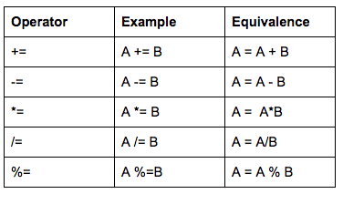

# Math Constants

```cpp
# include<cmath>;
 ```

The following symbols are defined for the values of their indicated expressions:

| Symbol     | Expression | Value                   |
|------------|------------|-------------------------|
| M_E        | e          | 2.71828182845904523536  |
| M_LOG2E    | log2(e)    | 1.44269504088896340736  |
| M_LOG10E   | log10(e)   | 0.434294481903251827651 |
| M_LN2      | ln(2)      | 0.693147180559945309417 |
| M_LN10     | ln(10)     | 2.30258509299404568402  |
| M_PI       | pi         | 3.14159265358979323846  |
| M_PI_2     | pi/2       | 1.57079632679489661923  |
| M_PI_4     | pi/4       | 0.785398163397448309616 |
| M_1_PI     | 1/pi       | 0.318309886183790671538 |
| M_2_PI     | 2/pi       | 0.636619772367581343076 |
| M_2_SQRTPI | 2/sqrt(pi) | 1.12837916709551257390  |
| M_SQRT2    | sqrt(2)    | 1.41421356237309504880  |
| M_SQRT1_2  | 1/sqrt(2)  | 0.707106781186547524401 |

# PreFix and PostFix
In C++, as in many languages, there are postfix and prefix operators.
The form for each is:

Incrementing
- prefix: ++a 
- postfix: a++

Decrementing
- prefix: --a 
- postfix: a-- 

The difference between prefix and postfix is subtle, but crucial.

The difference between prefix and postfix is subtle, but crucial.

Prefix operators increment the value of the variable, then return the reference to the variable.

Postfix operators create a copy of the variable and increments the value of the variable. Then it returns a copy from BEFORE the increment.

# Assignment operators


