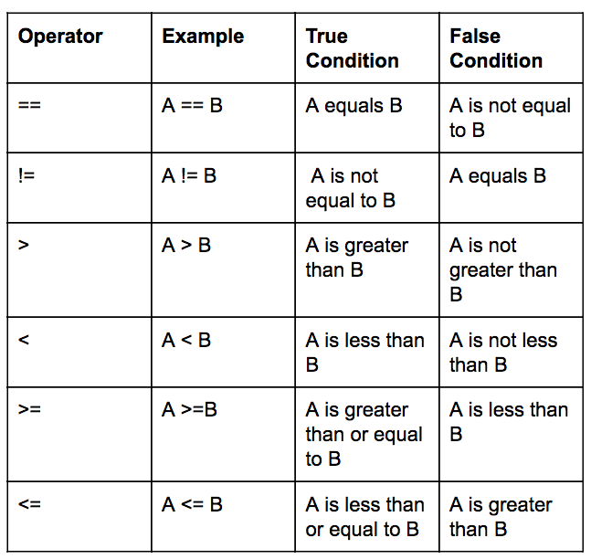

# Relational Operators

The relational and logical operators in C++



# Logic Operators


# if statements

```cpp
if(boolean expression)
{
     //statements to execute if the boolean expression is true
}
```

```cpp
if(boolean expression)
{
     //statements to execute if the boolean expression is true
}
else if (boolean expression #2)
{
     //statements to execute if the 'else if' boolean expression  #2 is true
}

else
{
     //statements to execute if the boolean expressions 
    //'if' and 'else if'  are false
}
```

# switch Statements

```cpp
switch(expression)
{
     case constant-expression : statements;
                               break; (this is optional);
     case constant-expression : statements;
                               break; (this is optional);
     ...

     default : //optional
        statements;
}
```

# for Loops
```cpp
#include <iostream>

int main()
{
    for(int i=0; i< 10;i++)
    {
        std::cout<<"i = "<<i<<"\n";
    }
    return 0;
}
```
# while Loops
```cpp
while(condition)
{
     statements;
}
```

# do while Loops
```cpp
do
{
     statements;
}while(condition );
```
# Infinite Loops

Sometimes it is desired to create an infinite loop. For example, in embedded systems a infinite loop is often used for the main task.

To create an infinite loop using a for loop:
```cpp
for( ; ;)
{
     std::cout<<"This for loop will run forever\n";
}
```
To create an infinite loop using a while loop:
```cpp
while(1)
{
     std::cout<<"This while loop will run forever\n";
}
```
# Exiting Loops

To exit a loop before it completes its normal sequence, we need to use control statements.

The two most commonly used are:

- break
- continue

The break statement:

The break statement will end the loop and begin executing the first statement that comes AFTER the end of the loop.

The continue statement: The continue statement will force the next iteration to be executed.